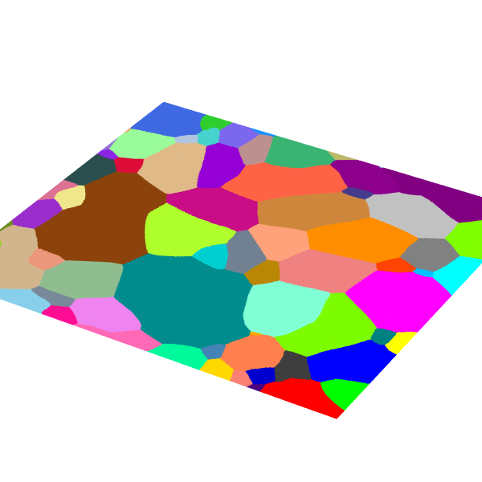
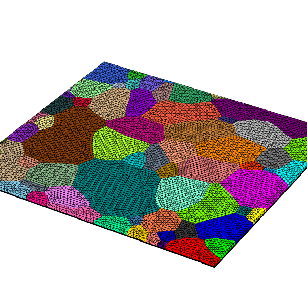

# Complex mesh
The aim of this folder is to build a complex mesh using neper.

## Input

The input are the input file used for craft.
1. `.vtk` is a vtk file on a strucutured grid
2. `.phase` is the phase ile containing the crystallographique orientation of each grainId.
Those file are contructed using [AITAToolbox](https://thomaschauve.github.io/aita/build/html/index.html) (It need to be change when the switch to [xarrayaita](https://thomaschauve.github.io/AITA-book/docs/intro.html) is done)

## Build mesh
### Build input file for [Neper](https://neper.info/)

The script `VTKtoNeper.py` build a `.tesr` file that can be understood by [Neper](https://neper.info/).

`./VTKtoNeper.py CI02_539x495_micro.vtk CI02_539x495.phase`

### Mesh the `.tesr`

First we need to clean the tesr file. It can have some irregularities :

`neper -T -loadtesr CI02_539x495_micro.tesr -transform "rmsat,grow" -o filtered`

Then we can build the mesh and extrud it on the 3rd dimension :

`neper -M filtered.tesr -dim 3 -rcl 0.5 -mesh2dalgo fron,dela`

You can directly use [Neper](https://neper.info/) to visualized the mesh. It is also possible to use [gmsh](https://gmsh.info/)

`neper -V filtered.tesr,filtered.msh -datavoxedgerad 0 -datacellcol id -dataelsetcol id -imagesize 600:600 -cameraangle 12 -showelt1d all -dataelt1drad 0.2 -showtesr 1 -showmesh 0 -print filtered-tesr -showtesr 0 -showmesh 1 -print filtered-mesh`

## Mesh to [rheolef](https://www-ljk.imag.fr/membres/Pierre.Saramito/rheolef/html/index.html)

To be taken as input in [rheolef](https://www-ljk.imag.fr/membres/Pierre.Saramito/rheolef/html/index.html) the mesh need to be processed.

`msh2geo filtered.msh > filtered_rheolef.geo`

**Notes**
1. All this seems to be ok
2. Cannot open `filtered_rheolef.geo` using [gmsh](https://gmsh.info/).
3. I think I still nead to defined the external surfaces used for loading, free surface or fixe point.
4. For now the orientation are strored within the mesh.
