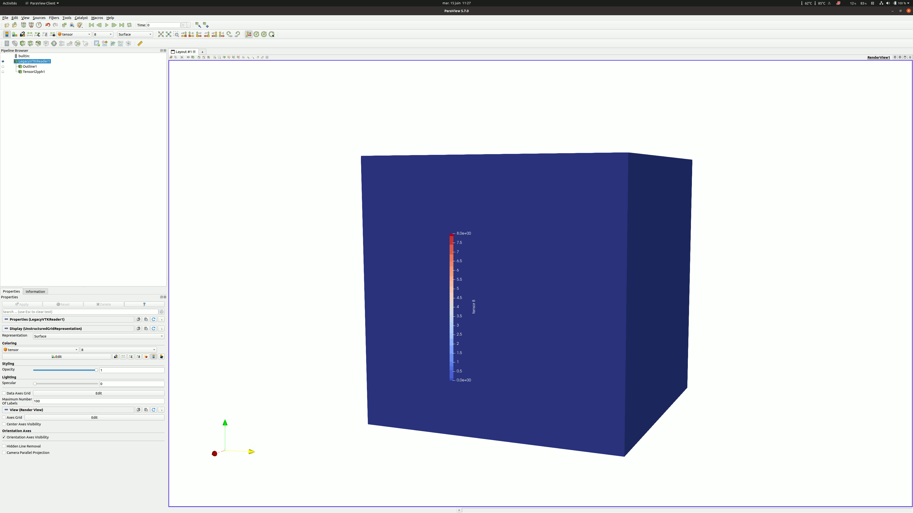

# Compute a Tensor $M=c \otimes c$

The aim of this folder is to learn how to build $M=c \otimes c$

Those test are done with rheolef 7.1

## Test
The `build_M.cc` file shows a mimimal example to understand how to build  `M`.

The results are strange. I do not understand what is wrong.

### Main code line

```c++
space Th (omega, grad_approx, "tensor");
...
field M(Th,0.0); // intitalised M
// replace each componant by a value
M[0,0] = 0; 
M[0,1] = 1; 
M[0,2] = 2; 

M[1,1] = 3; 
M[1,0] = 4; 
M[1,2] = 5; 

M[2,2] = 6; 
M[2,1] = 7; 
M[2,0] = 8; 
```

### Results



I do not understand the value observed in paraview for `M`.

Open the file : `field output/M.field`

- The component 0 equal 8
- The components 1 and 3 equal 7
- The component 4 equal 6
- the components 2/5/6/7/8 equal 0

:warning: It does not make any sense to me. Do you have any ideas ?

## Compilation
First you should compile run the make file :

`make`

Make `build_M` executable :

`chmod 750 build_M`

Therefore you can execute the code using the wrapper:

`./wrapper.sh`
